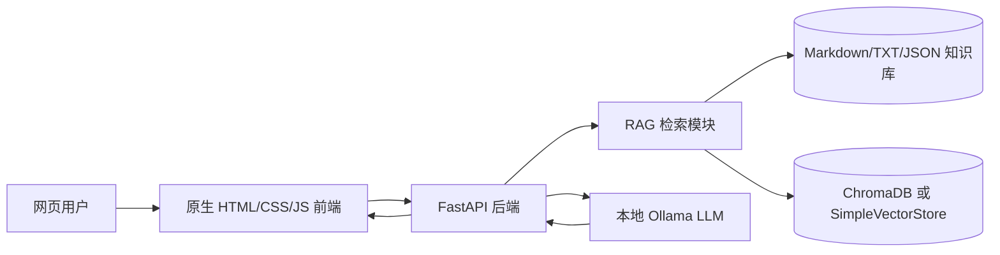
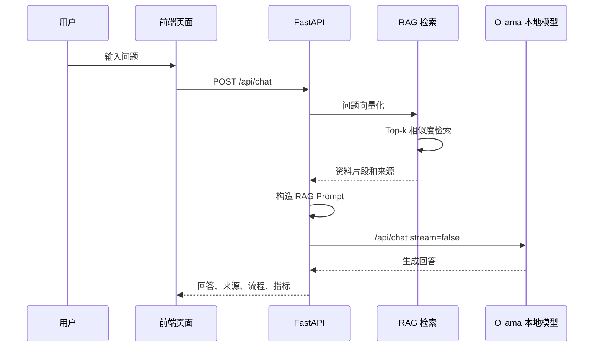

# 基于本地大模型与 RAG 技术的网站智能客服系统

## 项目简介

这是一个面向课程/实习展示的完整 Demo 项目。系统使用 Python、FastAPI、Ollama、本地知识库和 RAG 检索增强生成技术，实现 NXP AIoT Cloud / Cloud Lab / Ara240 / Edge AI / LLM Edge Studio / VLM Edge Studio 相关资料的智能客服问答。

默认不调用 OpenAI、ChatGPT API 或其他云端大模型服务。运行时优先连接本机 Ollama；如果 Ollama 未启动，后端会返回清晰提示，前端不会白屏。课堂演示时也可以设置 `MOCK_LLM=true` 先演示完整页面流程。

## 系统架构



RAG 流程：



## 技术栈

- 后端：Python 3.10+、FastAPI、Uvicorn、Requests、Pydantic、python-dotenv、numpy
- RAG：Ollama embedding、ChromaDB 持久化向量库、SimpleVectorStore fallback、TF-IDF fallback
- 前端：原生 HTML + CSS + JavaScript，由 FastAPI 直接挂载静态文件
- 默认模型：`LLM_MODEL=qwen2.5:7b`、`EMBED_MODEL=nomic-embed-text`

## 目录结构

```text
nxp-aiot-local-chatbot/
├── app/
│   ├── main.py
│   ├── config.py
│   ├── schemas.py
│   ├── ollama_client.py
│   ├── demo_llm.py
│   └── rag/
├── frontend/
├── data/
│   ├── knowledge_base/
│   └── vector_store/
├── scripts/
├── docs/
├── tests/
├── .env.example
├── requirements.txt
└── README.md
```

## 环境准备

```bash
cd nxp-aiot-local-chatbot

python -m venv .venv
source .venv/bin/activate
```

## 安装依赖

```bash
pip install -r requirements.txt
```

Windows 激活虚拟环境：

```powershell
.venv\Scripts\activate
```

## Ollama 安装和模型准备

先安装并启动 Ollama，然后拉取模型：

```bash
ollama pull qwen2.5:7b
ollama pull nomic-embed-text
```

默认配置：

```bash
cp .env.example .env
```

如果机器暂时没有 Ollama，可以在 `.env` 中设置：

```env
MOCK_LLM=true
EMBED_PROVIDER=tfidf
```

这样仍可演示网页、检索来源和 RAG 流程。

## 初始化知识库

项目已内置 7 份 demo 知识库文件。需要重新生成时运行：

```bash
python scripts/seed_demo_data.py
```

## 构建索引

```bash
python scripts/build_index.py
```

默认使用 Ollama 的 `nomic-embed-text` 生成向量，并优先保存到 ChromaDB。若 ChromaDB 不可用会退回 JSON 向量库；若 Ollama embedding 不可用会退回 TF-IDF，保证 Demo 能检索。

## 启动后端

```bash
uvicorn app.main:app --reload --host 0.0.0.0 --port 8000
```

## 打开网页

浏览器打开：

```text
http://localhost:8000
```

## 演示问题

主演示问题：

```text
我想基于 NXP AIoT Cloud 搭建一个离线运行的网站智能客服系统，用来回答 Ara240、LLM Edge Studio 和边缘 AI 部署相关问题。请问这个系统应该采用什么整体架构？知识库怎么构建？用户提问后 RAG 的完整流程是什么？本地部署相比云端调用有什么优势？
```

备用问题：

- 用户提问后，RAG 智能客服系统是如何从知识库中找到资料并生成回答的？
- LLM Edge Studio 和普通云端大模型调用有什么区别？它为什么适合边缘端智能应用？
- Ara240 DNPU 在边缘 AI 视觉分析任务中主要承担什么作用？
- 为什么这个项目不直接使用通用大模型回答，而要加入本地知识库和 RAG 检索？

API 内置的示例问题还包括：

- 我想基于 NXP AIoT Cloud 搭建一个离线运行的网站智能客服系统，应该采用什么整体架构？
- 用户提问后，RAG 智能客服系统的完整处理流程是什么？
- 本地大模型部署相比云端大模型调用有什么优势？
- LLM Edge Studio 的核心目标是什么？
- Ara240 DNPU 在边缘 AI 视觉任务中有什么作用？
- 为什么智能客服系统需要知识库检索，而不是直接让大模型回答？

## API

- `GET /api/health`：系统状态、Ollama 连接、模型名、知识库数量
- `GET /api/stats`：知识库文档数、chunk 数、分类
- `GET /api/sample-questions`：课堂演示问题
- `POST /api/rebuild-index`：重建知识库索引
- `POST /api/chat`：RAG 检索并调用本地模型生成回答

详细说明见 [docs/api_reference.md](docs/api_reference.md)。

## 答辩准备

技术实现细节、部署检查清单和老师可能追问的问题见 [docs/technical_defense_guide.md](docs/technical_defense_guide.md)。

## 测试

```bash
python scripts/smoke_test.py
python scripts/acceptance_check.py
pytest -q
```

`smoke_test.py` 会默认使用 `MOCK_LLM=true` 与 `EMBED_PROVIDER=tfidf`，因此没有 Ollama 时也能完成基础流程测试。
`acceptance_check.py` 会按任务书关键验收项检查目录结构、配置、文档、前端关键元素、API 行为、无 Ollama 降级和 MOCK 聊天流程。

## 常见问题排查

1. 页面能打开但模型状态显示未连接：确认已运行 Ollama，且 `OLLAMA_BASE_URL=http://localhost:11434`。
2. Chat 返回模型调用失败：执行 `ollama pull qwen2.5:7b`，或临时设置 `MOCK_LLM=true`。
3. 构建索引时 embedding 失败：执行 `ollama pull nomic-embed-text`，或设置 `EMBED_PROVIDER=tfidf`。
4. ChromaDB 安装失败：系统会自动使用 `SimpleVectorStore`，不影响课堂 Demo。
5. 检索结果很少：降低 `.env` 中的 `MIN_SCORE`，或补充更多知识库文档。

## 项目分工建议

- 后端同学：FastAPI 接口、Ollama 客户端、错误处理
- RAG 同学：文档加载、chunk、embedding、向量库、检索效果
- 前端同学：三栏页面、流程状态、来源展示、交互体验
- 文档同学：README、项目设计、演示脚本、报告截图

## 后续扩展方向

- 导入真实 NXP AIoT Cloud 官网资料并自动同步
- 增加后台知识库上传和索引管理
- 支持多模型切换和回答质量评估
- 增加会话历史、多轮问答和用户反馈
- 接入端侧硬件 Demo，展示 Ara240 / i.MX 场景资料问答
